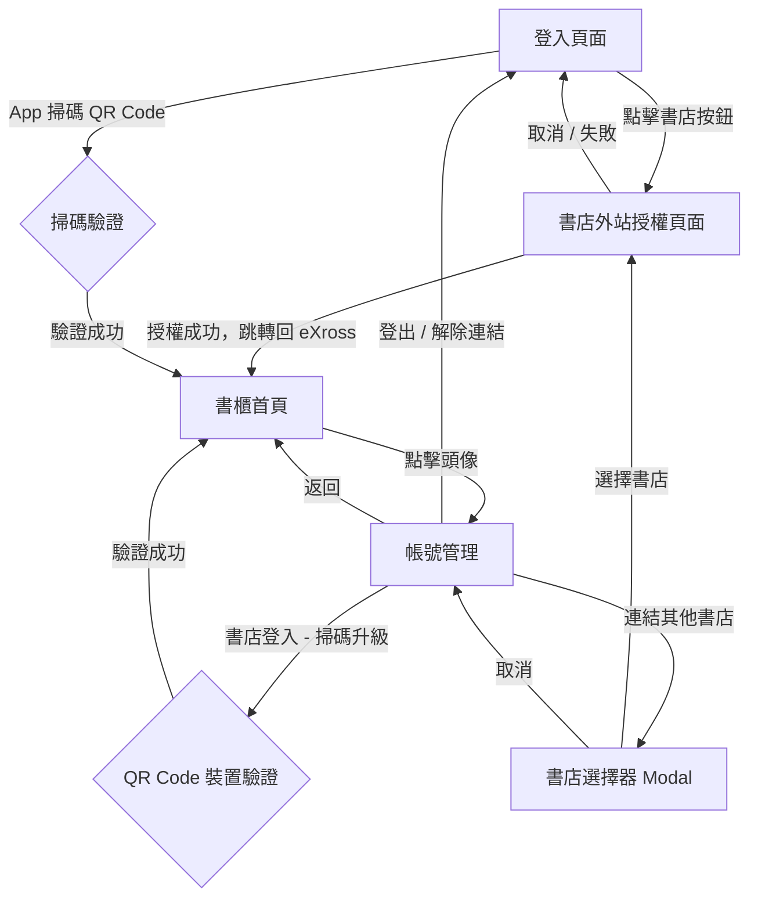

# 書紐 eXross — 登入頁面 & 帳號管理頁面 功能需求規格書

## 1. 文件總覽

本文件定義書紐 eXross **登入頁面**與**帳號管理頁面**的功能需求。

### 1.1 術語定義

| 術語             | 說明                                                                 |
|------------------|----------------------------------------------------------------------|
| 書店帳號登入     | 使用者透過特定書店（如三民書局、灰熊愛讀書）的 OAuth 外站授權完成登入 |
| 裝置登入         | 使用者透過書紐 App 掃描 QR Code，將此裝置設為信任裝置並完成登入      |
| 連結書店         | 已登入後，額外授權其他書店帳號以匯入該書店書櫃                       |
| 信任裝置         | 經由 App 掃碼驗證後的裝置，可直接存取 App 已連結的所有書店書櫃       |

### 1.2 系統狀態模型

系統核心維護以下狀態，頁面渲染與操作邏輯皆依此驅動：

| 狀態欄位       | 型態          | 說明                                           |
|----------------|---------------|------------------------------------------------|
| `isLoggedIn`   | Boolean       | 是否已登入                                     |
| `loginMethod`  | Enum          | 登入方式：`null`（未登入）/ `single`（書店帳號）/ `device`（裝置） |
| `linkedStores` | Array[String] | 已連結的書店名稱清單                           |

---

## 2. 登入頁面（Login Page）

### 2.1 頁面結構

登入頁面採 **左右分欄** 配置：

| 區域     | 比例 | 內容                                       |
|----------|------|--------------------------------------------|
| 品牌區   | 2/5  | 產品名稱「書紐 eXross」、品牌標語 |
| 登入卡片 | 3/5  | 所有登入操作入口                           |

> [!NOTE]
> 響應式設計：行動裝置（< 768px）時改為上下排列。

### 2.2 登入方式一覽

登入卡片內分為兩個並列區段，中間以「或」分隔線分開：

```
┌──────────────────────────────────────────────┐
│  登入書紐 eXross                              │
│  請選擇您的登入方式                           │
│                                               │
│  📱 使用書紐 App 掃碼登入                     │
│  ┌──────────────────────────────────┐         │
│  │  [QR Code]  │  倒數 / 狀態 / 重整  │         │
│  └──────────────────────────────────┘         │
│                                               │
│  ──────────── 或 ────────────                 │
│                                               │
│  📚 使用書店帳號登入                           │
│  ┌─────────┐  ┌──────────┐                    │
│  │ 三民書局 │  │灰熊愛讀書│                    │
│  └─────────┘  └──────────┘                    │
└──────────────────────────────────────────────┘
```

---

### 2.3 功能需求：QR Code 掃碼登入

#### FR-LOGIN-01：QR Code 直接內嵌顯示

| 項目     | 規格                                                                     |
|----------|--------------------------------------------------------------------------|
| 前置條件 | 使用者進入登入頁面                                                       |
| 行為     | QR Code 以 140×140px 區塊直接呈現於卡片中，**無需點擊按鈕才能展開**      |
| 說明文字 | 「開啟書紐 eXross App 掃描下方 QR Code，即可同步匯入您在各書店已購買的所有電子書」 |

#### FR-LOGIN-02：QR Code 有效期倒數

| 項目       | 規格                                                       |
|------------|-------------------------------------------------------------|
| 倒數時間   | **90 秒**                                                   |
| 顯示格式   | 「QR Code 重整倒數: **{秒數}** 秒」                        |
| 倒數結束時 | ① 掃描動畫停止 ② 狀態訊息變更為「QR Code 已失效，請重新整理」（紅色）③ 禁用掃描功能 |

#### FR-LOGIN-03：QR Code 重新整理

| 項目     | 規格                                                   |
|----------|--------------------------------------------------------|
| 觸發方式 | 點擊「重新整理」按鈕                                   |
| 行為     | 向後端請求新 QR Code → 重置倒數至 90 秒 → 恢復掃描動畫 → 狀態訊息回到「等待掃描中...」 |

#### FR-LOGIN-04：App 掃碼完成後的登入流程

| 項目     | 規格                                                                                 |
|----------|--------------------------------------------------------------------------------------|
| 觸發方式 | 後端通知前端 App 已完成掃碼驗證（建議使用 WebSocket / Polling）                      |
| 中間狀態 | 狀態訊息變更為「掃描成功！驗證裝置授權中...」（主題色顯示）                           |
| 完成行為 | ① 設定 `loginMethod = "device"` ② 寫入 App 端已連結的書店清單至 `linkedStores` ③ 導向書櫃首頁 |

---

### 2.4 功能需求：書店帳號 OAuth 登入

#### FR-LOGIN-05：書店選擇

| 項目     | 規格                                                     |
|----------|----------------------------------------------------------|
| 初始書店 | 三民書局、灰熊愛讀書（按鈕並排顯示）                     |
| 擴充性   | 未來需支援動態新增書店，建議書店清單由 API 提供           |
| 點擊行為 | 將網頁導向至該書店的外站授權頁面                         |

#### FR-LOGIN-06：OAuth 外站授權流程

| 項目       | 規格                                                                                                       |
|------------|------------------------------------------------------------------------------------------------------------|
| 觸發方式   | 使用者點擊書店按鈕後，瀏覽器導向至該書店的 OAuth 授權頁面（標準 OAuth 2.0 Authorization Code Flow）        |
| 外站操作   | 使用者在書店網站完成帳號登入與授權，授權完成後書店端透過 redirect URI 將使用者跳轉回 eXross                  |
| 回呼行為   | eXross 收到授權回呼 → 以 authorization code 換取 token → 設定 `loginMethod = "single"` → 將書店名稱加入 `linkedStores` → 導向書櫃首頁 |
| 取消 / 失敗 | 使用者在外站取消授權或授權失敗時，跳轉回登入頁面並顯示對應錯誤訊息                                         |

---

## 3. 書櫃首頁（Bookshelf）— 登入後 Header

### 3.1 Header 顯示規則

#### FR-SHELF-01：登入方式標籤

| 登入狀態                 | Header 右上角標籤文字       |
|--------------------------|------------------------------|
| 裝置登入                 | 「裝置登入」                 |
| 書店帳號登入（有連結書店）| 「{首個書店名稱}登入」       |
| 書店帳號登入（無書店）   | 「書店登入」                 |
| 未登入                   | 不顯示                       |

#### FR-SHELF-02：進入帳號管理

- 點擊 Header 右側使用者頭像區域，導向帳號管理頁面。

---

## 4. 帳號管理頁面（Account Management）

### 4.1 頁面結構

```
┌──────────────────────────────────────────────────────┐
│  [Header]                                            │
├──────────────────────────────────────────────────────┤
│  帳號管理                                             │
│  ┌──────────────────────────────────────────────┐    │
│  │  目前登入方式                                 │    │
│  │  {動態文字}                                   │    │
│  │──────────────────────────────────────────────│    │
│  │  {條件式區塊 A / B / C，依登入方式切換}       │    │
│  │──────────────────────────────────────────────│    │
│  │  [登出] 或 [解除此裝置連結]                   │    │
│  └──────────────────────────────────────────────┘    │
└──────────────────────────────────────────────────────┘
```

### 4.2 帳號管理：三種狀態下的 UI 差異

帳號管理頁面的核心區塊會依據 `loginMethod` 呈現完全不同的畫面組合，以下以表格統整：

| UI 元素                               | 書店帳號登入 (`single`) | 裝置登入 (`device`) | 未登入       |
|---------------------------------------|:-----------------------:|:-------------------:|:------------:|
| 目前登入方式文字                       | 「透過 {書店} 帳號登入」 | 「透過裝置登入」       | 「未登入」   |
| 已連結書店清單（唯讀標籤）             | ✗ 隱藏                  | ✓ 顯示              | ✗ 隱藏       |
| 「使用其他書店帳號連結」區塊           | ✗ 隱藏                  | ✗ 隱藏              | ✓ 顯示       |
| 「使用書紐 App 一鍵同步」QR Code 區塊 | ✓ 顯示                  | ✗ 隱藏              | ✓ 顯示       |
| 「登出」按鈕                           | ✓ 顯示                  | ✗ 隱藏              | ✗ 隱藏       |
| 「解除此裝置連結」按鈕                 | ✗ 隱藏                  | ✓ 顯示              | ✗ 隱藏       |

---

### 4.3 功能需求：書店帳號登入（`single`）後的帳號管理

#### FR-ACCT-01：登入狀態顯示

| 項目       | 規格                                                     |
|------------|----------------------------------------------------------|
| 顯示文字   | 「透過 {linkedStores[0]} 帳號登入」                      |
| 已連結書店 | 顯示於狀態文字下方：「已連結: {所有書店名，逗號分隔}」   |

#### FR-ACCT-02：書紐 App QR Code 同步區塊

| 項目       | 規格                                                                                           |
|------------|------------------------------------------------------------------------------------------------|
| 標題       | 「使用書紐 App 一鍵同步多家書櫃」                                                             |
| 說明       | 「掃描下方 QR Code，即可在網頁端同步檢視您於各書店購買的所有藏書。」                            |
| QR Code    | 直接內嵌顯示，含 90 秒倒數計時、重新整理按鈕、掃描狀態訊息（規格同 FR-LOGIN-02 ~ 04）         |
| 掃碼後行為 | `loginMethod` 切換為 `device` → 合併 App 書店清單至 `linkedStores`（去重）→ 導向書櫃首頁       |

> [!NOTE]
> 此功能的用途為：使用者以單一書店帳號登入後，可額外透過 App 掃碼將該裝置升級為「信任裝置」，一次匯入 App 端已授權的所有書店書櫃。

#### FR-ACCT-03：登出

| 項目       | 規格                                                   |
|------------|--------------------------------------------------------|
| 按鈕樣式   | 紅色危險按鈕（`btn-danger`）                           |
| 確認機制   | 彈出確認對話框：「確定要安全登出您的帳號嗎？」         |
| 確認後行為 | 清除所有狀態（`isLoggedIn = false`, `loginMethod = null`, `linkedStores = []`）→ 導回登入頁 |

---

### 4.4 功能需求：裝置登入（`device`）後的帳號管理

#### FR-ACCT-04：登入狀態顯示

| 項目       | 規格                                         |
|------------|----------------------------------------------|
| 顯示文字   | 「透過信任裝置登入」                         |

#### FR-ACCT-05：已連結書店清單（唯讀）

| 項目       | 規格                                                                     |
|------------|--------------------------------------------------------------------------|
| 標題       | 「您已透過 App 連結以下書店」                                            |
| 顯示方式   | 以標籤（tag）形式呈現所有 `linkedStores` 中的書店名稱                    |
| 空狀態     | 若無連結書店，顯示文字「尚無同步紀錄」                                   |
| 可編輯性   | **唯讀**。書店連結由 App 端管理，Web 端不提供增刪功能                     |

#### FR-ACCT-06：解除裝置連結

| 項目       | 規格                                                                         |
|------------|------------------------------------------------------------------------------|
| 按鈕文字   | 「解除此裝置連結」                                                           |
| 按鈕樣式   | 紅色危險按鈕（`btn-danger`）                                                 |
| 確認機制   | 彈出確認對話框：「確定要解除此裝置的信任連結嗎？解除後需重新登入。」         |
| 確認後行為 | 清除所有狀態（同 FR-ACCT-03）→ 導回登入頁                                   |

> [!IMPORTANT]
> 裝置登入模式下，**隱藏所有帳號管理操作區塊**（含「連結其他書店」與「QR Code 同步」），僅保留唯讀書店清單和「解除此裝置連結」按鈕。設計意圖為：裝置登入使用者的書店管理應回到 App 端進行。

---

### 4.5 功能需求：書店選擇器（帳號管理進入）

#### FR-ACCT-07：連結其他書店

| 項目       | 規格                                                                           |
|------------|--------------------------------------------------------------------------------|
| 觸發條件   | 從帳號管理頁面操作（此按鈕在書店帳號登入模式下隱藏，但保留邏輯供未來擴充）     |
| Modal 標題 | 「連結其他書店」（與登入頁面的「選擇授權書店」區分）                           |
| 書店清單   | 同登入頁面的書店列表                                                           |
| 授權完成後 | 將新書店加入 `linkedStores`（不重複）→ 返回書櫃首頁                            |

---

## 5. 頁面導航與狀態流程

### 5.1 整體頁面流程圖



### 5.2 Modal Overlay 規則

| 規則                     | 說明                                                           |
|--------------------------|----------------------------------------------------------------|
| 背景保留                 | 開啟 Modal（OAuth / 書店選擇器 / QR 掃描）時，前一頁面保持可見但以半透明黑色遮罩覆蓋 |
| 毛玻璃效果               | Modal 容器套用 `backdrop-filter: blur(4px)`                    |
| 返回邏輯                 | 取消時回到「來源頁面」（`sourceView`），非固定頁面              |

---

## 6. QR Code 共用元件規格

登入頁面與帳號管理頁面皆使用同一套 QR Code 元件，以下統一定義其行為：

| 屬性                 | 規格                                                               |
|----------------------|--------------------------------------------------------------------|
| QR Code 尺寸         | 登入頁內嵌: 140×140px；Modal 彈窗: 240×240px                      |
| 有效時間             | 90 秒                                                              |
| 倒數顯示             | 即時更新秒數                                                       |
| 掃描動畫             | 水平掃描線，2.5 秒循環，QR Code 失效後隱藏                        |
| 狀態訊息變化         | 見下表                                                             |
| 重新整理             | 重新向後端請求 QR Code，重置計時器與狀態                           |

**QR Code 狀態訊息轉換：**

| 狀態       | 訊息文字                           | 顏色       |
|------------|------------------------------------|------------|
| 等待掃描   | 「等待掃描中...」                  | 灰色       |
| 掃描成功   | 「掃描成功！驗證裝置授權中...」    | 主題色     |
| QR 失效    | 「QR Code 已失效，請重新整理」     | 紅色       |

---

## 7. 非功能需求

| 項目           | 規格                                                                           |
|----------------|--------------------------------------------------------------------------------|
| 瀏覽器支援     | Chrome / Edge / Safari / Firefox 最近兩個主要版本                             |
| 響應式         | 桌面優先設計，768px 以下改為單欄排版                                          |
| 狀態持久化     | 登入狀態需持久化（localStorage 或 server session），重新整理瀏覽器不應遺失登入 |
| 安全性         | QR Code 具 90 秒時效；OAuth token 需加密存放；登出時清除所有 client-side 快取  |
| 無障礙         | 按鈕與互動元素需具備明確的 `title` 或 `aria-label`                            |
| 動畫           | 頁面切換使用 fade-in 動畫（300ms）；Modal 使用 slide-up + scale 動畫          |

---

## 9. 附錄：原型參考檔案

本需求書依據以下原型檔案撰寫，開發時可作為互動行為的參考基準：

| 檔案                                                    | 說明                   |
|---------------------------------------------------------|------------------------|
| [index.html](file:///d:/Projects/login%20user%20test/index.html) | 頁面結構與元件配置     |
| [app.js](file:///d:/Projects/login%20user%20test/app.js)         | 狀態管理與互動邏輯     |
| [style.css](file:///d:/Projects/login%20user%20test/style.css)   | 視覺樣式與動畫定義     |
| [daily_log.md](file:///d:/Projects/login%20user%20test/daily_log.md) | 原型迭代變更紀錄   |
